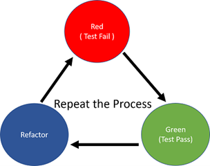
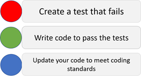
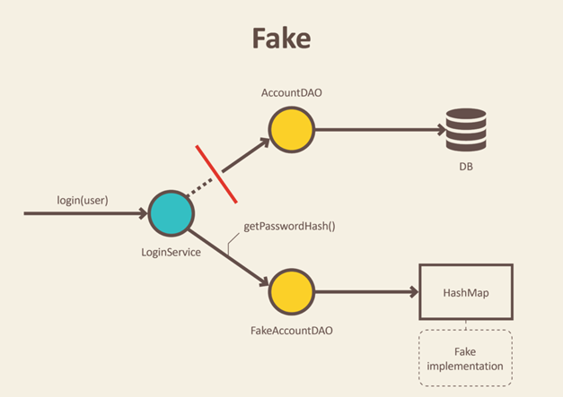
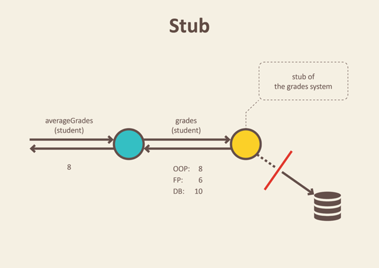
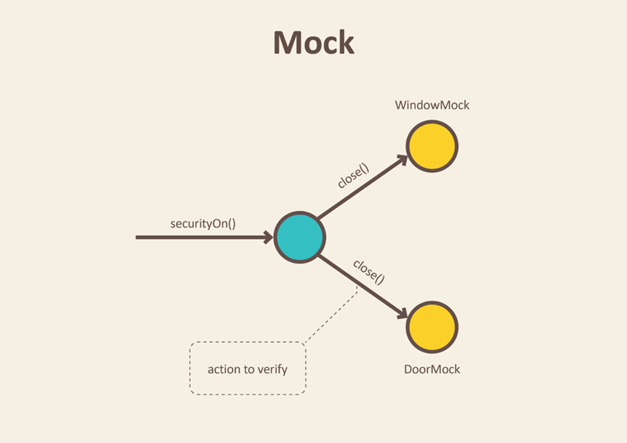

Automated testing during development
==============

# Overview

Automated testing during development is an important step to make development more productive and robust. 

It leads to faster deployment circles with better code quality.

# Why do we need (automated) unit testing?

One of the most valuable benefits of using testing like unit tests for your development is that it may give you positive confidence that your code will work as you have expected it to work in your development process. Unit tests always give you the certainty that it will lead to a long term development phase because with the help of unit tests you can easily know that your foundation code block is totally dependable on it.

There are few reasons that can give you a basic understanding of why a developer needs to design and write out test cases to make sure major requirements of a module are being validated during testing: 
	
-	Unit testing can increase confidence and certainty in changing and maintaining code in the development process. Unit testing is a protection against regression errors introduced with app changes

-	Unit testing always has the ability to find problems in early stages in the development cycle.

-	Codes are more reusable, reliable and clean.

-	Development becomes faster.

-	Testing becomes faster and more reliable as the alternative - functional testing - requires to fully setup the app with additional environment required and running tests manually. This time consuming and error prone

-	Easy to automate by using batch files as simplest solution or more sophisticated employing a CI/CD software like GitHub or GitLab

-	Automatic documentation of the app as the unit tests show how the usage of the code is intended by developer


Read more at - http://agiledata.org/essays/tdd.html

# Basics on testing

## Manually testing (functional testing)

Manual testing is most basic kind of testing a source code. Manual testing means starting the app and test certain functionality by clicking buttons, inserting data etc. and then checking the result produced by the app.

	
-	Manually testing is time consuming: you need too much time for testing too few functionality of a source code

-	Manually testing is error prone due to regression errors from later code changes

-	Functional testing is potentially unsystematic

-	In practice using manually testing leads to tight coupled, complex code design which is badly or not at all testable automatically

-	Testing code with different real world situations is nearly impossible

Try to use unit tests as much as possible instead of manual testing. Especially during debugging you should change as soon as possible to test writing instead of further debugging. As soon as you know what happens you should write a test giving the method to test the input you have seen during debugging. The first tests written this way may be painful but the code stability grows with each test and the expensive time demand for debugging is shrinking. So you get more productive. Manual testing / bug search with the debugger is the most expensive way of testing / bug fixing!!

## Unit testing and integration testing

Unit tests are easy to write in C# if you employ a test framework like NUnit.

If your tests requires infrastructure dependencies like databases we speak normally not of unit tests but of integration tests.

Place unit tests in a separate test project.

Unit tests are normally less demanding and much faster running. Therefore it is possible to run them more often in the CI process.

As integration tests are more demanding to coding and the required test environment they should be the last option generally. Try to replace them with unit tests as far as possible.

## Characteristics of a good unit test

Microsoft says a good test has basically the following characteristics:

-	Fast: It isn't uncommon for mature projects to have thousands of unit tests. Unit tests should take little time to run. Milliseconds.

-	Isolated: Unit tests are standalone, can be run in isolation, and have no dependencies on any outside factors such as a file system or database.

-	Repeatable: Running a unit test should be consistent with its results, that is, it always returns the same result if you don't change anything in between runs.

-	Self-Checking: The test should be able to automatically detect if it passed or failed without any human interaction.

-	Timely: A unit test shouldn't take a disproportionately long time to write compared to the code being tested. If you find testing the code taking a large amount of time compared to writing the code, consider a design that is more testable.

Source: https://learn.microsoft.com/en-us/dotnet/core/testing/unit-testing-best-practices

One test should have only one task to test. Try to avoid bundling tests in one test methods. This makes the interpretaton of a test result more clear. Try to use test cases instead of bundling in one method. 

## Test driven development TDD

Unit testing refers to what you are testing, TDD to when you are testing.

The two are orthogonal.

Unit testing means, well, testing individual units of behavior. An individual unit of behavior is the smallest possible unit of behavior that can be individually tested in isolation. (I know that those two definitions are circular, but they seem to work out quite well in practice.)
You can write unit tests before you write your code, after you write your code or while you write your code.

TDD means (again, kind of obvious) letting your tests drive your development (and your design). You can do that with unit tests, functional tests and acceptance tests. Usually, you use all three.

The most important part of TDD is the middle D. You let the tests drive you. The tests tell you what to do, what to do next, when you are done. They tell you what the API is going to be, what the design is. (This is important: TDD is not about writing tests first. There are plenty of projects that write tests first but don't practice TDD. Writing tests first is simply a prerequisite for being able to let the tests drive the development.)

To keep the (later) effort for bugfixing and maintenance as low as possible an app should employ a test driven design. Test driven development (TDD) means developing (at least basic) tests for a functionality before the functionality itself is implemented. 

TDD provides some aspects for good coding:

-	Documentation of functionality

-	(Automated) testability of functionality in case of later code changes

-	Protection against regression: regression defects are defects introduce when a change is made to existing code

-	TDD enlarges productivity of coding: tests are runnable without full app environment

-	Code is fully tested code upfront. It's painless testing.

-	It forces you to design your classes correctly.

-	It also forces you to keep it simple stupid.

-	The cycle of Red-Green-Refactor is the absolute procrastination killer!


## TDD: The cycle of Red-Green-Refactor

The cycle of Red-Green-Refactor is one of the most powerful tools to achieve good source code quality and productivity. 




Source: https://www.c-sharpcorner.com/article/a-basic-introduction-of-unit-test-for-beginners/



		
Red
	
-	First write a test for code unit which fails (red test result). Write the test based on the AAA approach: Arrange-Act-Assert. A reader of your code should easily see the AAA structure of your test.

Green

-	Implement the code unit and make it work. Then run the test with a green result.

Refactor

- 	Refactor and comment the code unit and the test immediately after the green test result.

See a sample for the AAA pattern in a test method:

``` csharp
	[Test]
	public void IsPrime_InputIs1_ReturnFalse()
	{

		// Arrange 

		// Act
		var result = _primeService.IsPrime(1);
		
		// Arrange
		Assert.IsFalse(result, "1 should not be prime");
	}

```


# Practical unit testing

## Prerequisites for unit testing

### Add required test projects

As a rule of thumb there should be one unit test project per solution. If integration tests are required they should be separated from unit test in a integration test project. So a solution will end up with at least one or maximum two test projects included.

If your tests requires infrastructure dependencies like databases we speak normally not of unit tests but of integration tests. Integration tests should be separated from unit tests as they are normally more complex and running it automatically might much slower then unit tests. If you employ a CI / CD environment to automated testing, building and deploying software it may be helpful to tasks with other schedules for unit tests and integration tests. Think as a simple example for running unit tests on a daily base and integration tests only once on weekends.

Choose the correct VS project template for NUnit testing of .NET Core.

### Add a AssemblySetup class to each test project

AssemblySetup class is intended to setup the general environment for the test before the tests are running. Setup for logging, test data environment etc will be done in this class. After finishing the test you can implement a cleanup method to clean the test environment from old data etc.

``` csharp

/// <summary>
/// Setup and cleanup for the whole test assembly
/// </summary>
[SetUpFixture]
public static class AssemblySetup
{
	
	[OneTimeSetUp]
	public static void SetUp()
	{
		Debug.Print("Assembly setup: setup test environment here");
	}
	
	
	[OneTimeTearDown]
	public static void Cleanup()
	{
		Debug.Print("Assembly tear down: clean test environment here");
	}
	
}
```
## Basics of writing a good test

Tests document code. But this only of practical use if the tests are well readable. So basically apply the same rules for good production code to your test code.

Structure all test with AAA pattern: Arrange-Act-Assert. It is a good idea to create a code snippet for Visual Studio for this in C#. For general info on snippets see https://learn.microsoft.com/de-de/visualstudio/ide/walkthrough-creating-a-code-snippet?view=vs-2022. 

Test methods should at least have one Assert in the Assert section of the method.

Here a snippet for the plain AAA pattern:


``` xml
<?xml version="1.0" encoding="utf-8"?>
<CodeSnippets xmlns="http://schemas.microsoft.com/VisualStudio/2005/CodeSnippet">
    <CodeSnippet Format="1.0.0">
		<Header>
			<Title>xaaa</Title>
			<Author>Robert Leisner</Author>
			<Description>Insert the Arrange-Act-Assert pattern (AAA) in a test method</Description>
			<Shortcut>x3a</Shortcut>
			<SnippetTypes>
				<SnippetType>Expansion</SnippetType>
			</SnippetTypes>
		</Header>
		<Snippet>
		  <Code Language="CSharp">
				<![CDATA[// Arrange 
				
				
				// Act  
				
				
				// Assert
				
				]]>
		  </Code>

			</Snippet>
      </CodeSnippet>
</CodeSnippets>
```

And here a snippet for a full test method with AAA pattern:

``` xml
<?xml version="1.0" encoding="utf-8"?>
<CodeSnippets xmlns="http://schemas.microsoft.com/VisualStudio/2005/CodeSnippet">
    <CodeSnippet Format="1.0.0">
		<Header>
			<Title>xtdd</Title>
			<Author>Robert Leisner</Author>
			<Description>Create a test method</Description>
			<Shortcut>xtdd</Shortcut>
			<SnippetTypes>
				<SnippetType>Expansion</SnippetType>
			</SnippetTypes>
		</Header>
		<Snippet>
		  <Code Language="CSharp">
				<![CDATA[[Test]
        public void Test()
        {
            // Arrange 


            // Act  


            // Assert


        }
				]]>
		  </Code>

			</Snippet>
      </CodeSnippet>
</CodeSnippets>
```

## Create test classes

Here a sample of a test class for a fictive PrimeService class:

``` csharp
[TestFixture]
public class UnitTest_PrimeService
{
	private PrimeService _primeService;
	
	[SetUp]
	public void SetUp()
	{
		_primeService = new PrimeService();
	}
	
	[TearDown]
	public void CleanUp()
	{
		_primeService.Dispose()
	}
	
	
	[Test]
	public void IsPrime_InputIs1_ReturnFalse()
	{

		// Arrange 

		// Act
		var result = _primeService.IsPrime(1);
		
		// Arrange
		Assert.IsFalse(result, "1 should not be prime");
	}
}
```

Create separate (at least one) test class for each productive class to test. SetUp and TearDown methods are not required but especially for integration testing with more complex scenarios it does make sense to use them to define exact test scenarios and to save ressources. 


Each single test in a test class is marked with the [Test] (or the [TestCase] attribute in more complex data driven tests). 

## Naming conventions for test projects, test classes and test methods

A common naming convention for tests classes and methods you see in the above sample.

Unit tests and integration tests should separated in a project only for unit tests and another one only for integration tests. Unit test projects should be name with ProjectXUnitTests. Integration tests should be name with ProjectXIntTests.

Imagine you have to write tests for a class PrimeService. Then the test class should be named PrimeServiceTests.

Microsoft recommends naming test methods as follows: NameOfMethodeOrPropertyToBeTested_ScenarioToTest_ExpectedResult.

For more details see: https://learn.microsoft.com/en-us/dotnet/core/testing/unit-testing-best-practices


## Code design for unit testing and TDD

Automated testing with unit tests requires a loosely coupled app design, which makes it possible to replace dependencies with other implementations or fakes.

### S.O.L.I.D: the five basic principles of object-oriented programming and design

The SOLID concepts are:

-	The Single-responsibility principle: "There should never be more than one reason for a class to change.". In other words, every class should have only one responsibility.

-	The Open-closed principle: "Software entities ... should be open for extension, but closed for modification."

-	The Liskov substitution principle: "Functions that use pointers or references to base classes must be able to use objects of derived classes without knowing it". See also design by contract.

-	The Interface segregation principle: "Many client-specific interfaces are better than one general-purpose interface."

-	The Dependency inversion principle: "Depend upon abstractions, not concretions." 


Source: https://en.wikipedia.org/wiki/SOLID


### Inversion of control (IoC) - the concept behind DI

This states that a class should not configure its dependencies statically but should be configured by some other class from outside.

It is the fifth principle of S.O.L.I.D which states that a class should depend on abstraction and not upon concretions (in simple terms, hard-coded).

According to the principles, a class should concentrate on fulfilling its responsibilities and not on creating objects that it requires to fulfill those responsibilities. And that's where dependency injection comes into play: it provides the class with the required objects.

``` csharp
/// <summary>
/// Class represents a car
/// </summary>
public class Car
{

    private readonly Engine _engine;

    /// <summary>
    /// Default cor
    /// </summary>
    public Car()
    {
        // Instanciated the engine here:tight coupled because _engine is not changeable
        _engine = new Engine();

    }

	...
}
```

The Engine class can't be replaced i.e. with another implementation or a fake for unit testing

``` csharp
/// <summary>
/// Class represents a car
/// </summary>
public class Car
{

	private readonly Engine _engine;

	/// <summary>
	/// Default cor
	/// </summary>
	/// <param name="engine"></param>
	public Car(Engine engine)
	{
		// *****************************
		// Store the injected instance locally: loose coupling
		// *****************************
		_engine = engine;

	}

	...

}
```

The Engine class can easily be replaced with another implementation or a fake for unit testing.

IoC makes only sense with the introduction of interfaces!

### Dependency injection (DI)

Dependency injection makes loose coupling of classes possible. The main question is: how do I get my required dependencies in a class from outside the class. Benefits of using DI are:


	
-	Helps in Unit testing.

-	Boiler plate code is reduced, as initializing of dependencies is done by the injector component.

-	Extending the application becomes easier.

-	Helps to enable loose coupling, which is important in application programming.

There are basically three types of dependency injection:

	
-	constructor injection: the dependencies are provided through a class constructor.

-	setter injection: the client exposes a setter method that the injector uses to inject the dependency.

-	interface injection: the dependency provides an injector method that will inject the dependency into any client passed to it. Clients must 
implement an interface that exposes a setter method that accepts the dependency.


Service locator style of injection may be called a type of dependency injection too but its usage isn't recommend (see below).

#### Constructor injection


The dependencies of a class are injected via the constructor of a class. This is the preferred way on dependency injection.


``` csharp
// Using default spellchecker	
ISpellChecker _checker  =new XSpellChecker()
var editor = new TextEditor(_checker)

// Using another spellchecker
var _checker  =new YSpellChecker()
var editor = new TextEditor(_checker)

// Using a fake for testing	
var _checker  =new FakeSpellChecker()
var editor = new TextEditor(_checker)
```

### Service locator style of injection

Via a central dependency manager a required dependency is resolved from inside the class:

``` csharp
var instance = DependencyManager.GetInstance<ISpellChecker>()
```

This type of dependency injection works but is not very transparent from outside the class. Therefore it should by avoided and replaced by constructor injection.

# Test doubles: faking, stubbing and mocking
Based on: Test Doubles - Fakes, Mocks and Stubs. | by Michal Lipski | Pragmatists https://dev.to/milipski/test-doubles---fakes-mocks-and-stubs

In automated testing it is common to use objects that look and behave like their production equivalents, but are actually simplified. This reduces complexity, allows to verify code independently from the rest of the system and sometimes it is even necessary to execute self validating tests at all. A Test Double is a generic term used for these objects.

## Fake

Fakes are objects that have working implementations, but not same as production one. Usually they take some shortcut and have simplified version of production code.

An example of this shortcut, can be an in-memory implementation of Data Access Object (DAO) or Repository. This fake implementation will not engage database, but will use a simple collection to store data. This allows us to do integration test of services without starting up a database and performing time consuming requests.



Source: https://dev.to/milipski/test-doubles---fakes-mocks-and-stubs

Apart from testing, fake implementation can come handy for prototyping and spikes. We can quickly implement and run our system with in-memory store, deferring decisions about database design. Another example can be also a fake payment system, that will always return successful payments.


## Stub

Stub is an object that holds predefined data and uses it to answer calls during tests. It is used when we cannot or don't want to involve objects that would answer with real data or have undesirable side effects.

An example can be an object that needs to grab some data from the database to respond to a method call. Instead of the real object, we introduced a stub and defined what data should be returned.



Source: https://dev.to/milipski/test-doubles---fakes-mocks-and-stubs

Instead of calling database from Gradebook store to get real students grades, we preconfigure stub with grades that will be returned. We define just enough data to test average calculation algorithm.

### Command Query Separation

Methods that return some result and do not change the state of the system, are called Query. Method averageGrades, that returns average of student grades is a good example.


```

Double averageGrades(Student student);

```

It returns a value and is free of side effects. As we have seen in students grading example, for testing this type of method we use Stubs. We are replacing real functionality to provide values needed for method to perform its job. Then, values returned by the method can be used for assertions.

There is also another category of methods called Command. This is when a method performs some actions, that changes the system state, but we don't expect any return value from it.

``` csharp
void sendReminderEmail(Student student);
```

A good practice is to divide an object's methods into those two separated categories.

This practice was named: Command Query separation by Bertrand Meyer in his book "Object Oriented Software Construction".

For testing Query type methods we should prefer use of Stubs as we can verify method's return value. But what about Command type of methods, like method sending an e-mail? How to test them when they do not return any values? The answer is Mock - the last type of test dummy we gonna cover.


We don't want to close real doors to test that security method is working, right? Instead, we place door and window mocks objects in the test code.


After execution of securityOn method, window and door mocks recorded all interactions. This lets us verify that window and door objects were instructed to close themselves. That's all we need to test from SecurityCentral perspective.


You may ask how can we tell if door and window will be closed for real if we use mock? The answer is that we can't. But we don't care about it. This is not responsibility of SecurityCentral. This is responsibility of Door and Window alone to close itself when they get proper signal. We can test it independently in different unit test.


## Mock

Mocks are objects that register calls they receive.

In test assertion we can verify on Mocks that all expected actions were performed.

We use mocks when we don't want to invoke production code or when there is no easy way to verify, that intended code was executed. There is no return value and no easy way to check system state change. An example can be a functionality that calls e-mail sending service.

We don't want to send e-mails each time we run a test. Moreover, it is not easy to verify in tests that a right email was send. Only thing we can do is to verify the outputs of the functionality that is exercised in our test. In other worlds, verify that e-mail sending service was called.

Similar case is presented in the following example:




Source: https://dev.to/milipski/test-doubles---fakes-mocks-and-stubs


# Test levels

## Unit tests

Unit tests are written to test a specific code part.

Basic rule: one method or property has at least on unit test

Unit tests should be written in a separate test project as part of the solution. The test run is done manually or in more advanced environments in a Continuous Integration and Continuous Delivery (CI/CD) chain.

CI/CD requires a source code repository like GIT. CI/CD takes the source code from the repository, builds the application and runs the tests automatically.

## Integration tests

Integration tests are intended to test more complex sceanios integrating external dependencies like databases, webservices etc..

The complexity of integration tests can be demanding to setup. But they help to avoid issues at the customer side.

Integration tests should be written in a separate test project as part of the solution. The test run is done manually or in more advanced environments in a CI/CD chain.

## Application level tests

The app is installed in production like environment. Then automated tests written i.e. in Python communicate with app and check if the app is behaving as expected.


## Manual testing

The highest level of testing is the final manual testing. It is time consuming and very expensive compared to the lower testing levels..

It should follow a accuratley planned test plan to make the results reliable.

The better the quality of the lower levels of testing the less time consuming and expensive the final manual testing will be. So it is a good idea to start with good unit testing and add integration testing if needed. Applicaton level tests is helpful but demanding and normally only for bigger environments to achieve.

# Practical dev tools for automated testing

## Test settings

### Making internal methods visiible for testing

Projects based on AssemblyInfo.cs (NOT recommended anymore)

``` csharp
[assembly: InternalsVisibleTo("Bodoconsult.Web.Mvc.Test")]
```

Projects based on csproj file

``` xml
<Project Sdk="Microsoft.NET.Sdk">
  <PropertyGroup>
    <OutputType>Exe</OutputType>
    <TargetFramework>netcoreapp3.0</TargetFramework>
  </PropertyGroup>

  <ItemGroup>
    <AssemblyAttribute Include="System.Runtime.CompilerServices.InternalsVisibleToAttribute">
    <_Parameter1>ClassLibrary1.Tests</_Parameter1>
    </AssemblyAttribute>
  </ItemGroup>
</Project>

```

## Visual Studio snippets

### Snippet for AAA pattern

``` xml
<?xml version="1.0" encoding="utf-8"?>
<CodeSnippets xmlns="http://schemas.microsoft.com/VisualStudio/2005/CodeSnippet">
    <CodeSnippet Format="1.0.0">
		<Header>
			<Title>xaaa</Title>
			<Author>Robert Leisner</Author>
			<Description>Insert the Arrange-Act-Assert pattern (AAA) in a test method</Description>
			<Shortcut>x3a</Shortcut>
			<SnippetTypes>
				<SnippetType>Expansion</SnippetType>
			</SnippetTypes>
		</Header>
		<Snippet>
		  <Code Language="CSharp">
				<![CDATA[// Arrange 
				
				
				// Act  
				
				
				// Assert
				
				]]>
		  </Code>

			</Snippet>
      </CodeSnippet>
</CodeSnippets>
```

### Snippet for test method

``` xml
<?xml version="1.0" encoding="utf-8"?>
<CodeSnippets xmlns="http://schemas.microsoft.com/VisualStudio/2005/CodeSnippet">
    <CodeSnippet Format="1.0.0">
		<Header>
			<Title>xtest</Title>
			<Author>Robert Leisner</Author>
			<Description>Create a test method</Description>
			<Shortcut>xtest</Shortcut>
			<SnippetTypes>
				<SnippetType>Expansion</SnippetType>
			</SnippetTypes>
		</Header>
		<Snippet>
		  <Code Language="CSharp">
				<![CDATA[[Test]
        public void Test()
        {
            // Arrange 


            // Act  


            // Assert


        }
				]]>
		  </Code>

			</Snippet>
      </CodeSnippet>
</CodeSnippets>
```


```


```


## Use Moq for mocking

### Mocking an class or interface

The following code fragment shows a business logic to be tested:

``` csharp

  public interface IDoSomethingService
  {
  /// <summary>
      /// Property changed by <see cref="DoSomething"/>
      /// </summary>
      bool Changed { get; set; }

      /// <summary>
      /// Do something and return a string
      /// </summary>
      /// <param name="a">String A</param>
      /// <param name="b">String B</param>
      /// <returns>String A concatenated with string B</returns>
      string DoSomeThingWithReturnValue(string a, string b);


      /// <summary>
      /// Do something without return a value;
      /// </summary>
      void DoSomething();

  }

  public class DemoClass
  {

      private IDoSomethingService _service;

      /// <summary>
      /// Default ctor
      /// </summary>
      /// <param name="service">Injcted service dependecy</param>
      public DemoClass(IDoSomethingService service)
      {
          _service = service;
      }


      /// <summary>
      /// Create a smaple string
      /// </summary>
      /// <returns>Sample string</returns>
      public string CreateString(string a, string b)
      {

          string result;

          // Do other things here

          result = _service.DoSomeThingWithReturnValue(a, b);

          // Do other things here

          return result;
      }

      /// <summary>
      /// Run an action
      /// </summary>
      public void DoSomething()
      {
          _service.DoSomething();
      }
  }
```

### Testing a method with a return value

``` csharp
[Test]
public void DoSomeThingWithReturnValue_TwoString_ReturnsConcatenatedString()
{
    // Arrange
    const string inputA = "This is an ";
    const string inputB = "example";
    const string expectedResult = "This is an example";

    var mockService = new Mock<IDoSomethingService>();
    mockService.Setup(x => x.DoSomeThingWithReturnValue(inputA, inputB)).Returns(expectedResult);

    var demo = new DemoClass(mockService.Object);

    // Act
    var result = demo.CreateString(inputA, inputB);

    // Assert
    // Assert returned value is as expected
    Assert.That(result, Is.EqualTo(expectedResult));

    // Assert method called only onces
    mockService.Verify(m => m.DoSomeThingWithReturnValue(inputA, inputB), Times.Once());
}

```


### Testing a method without return value with changing property values from mocked method

Setting up a test a method that changes a property value of the mocked object:     


``` csharp
[Test]
public void DoSomethingWith_DefaultSetup_PropertyChanged()
{
    // Arrange
    const bool expectedResult = true;

    var mockService = new Mock<IDoSomethingService>();
    mockService.Setup(x => x.Changed).Returns(false);
    mockService.Setup(x => x.DoSomething())
        .Callback(() => mockService.SetupGet(y => y.Changed).Returns(true));

    var demo = new DemoClass(mockService.Object);

    // Act
    demo.DoSomething();

    // Assert
    // Assert property is changed as expected
    Assert.That(mockService.Object.Changed, Is.EqualTo(expectedResult));

    // Assert method called only onces
    mockService.Verify(m => m.DoSomething(), Times.Once());

}
```

### Additional info on Moq

https://www.codemag.com/Article/2305041/Using-Moq-A-Simple-Guide-to-Mocking-for-.NET

https://www.code4it.dev/blog/check-objects-called-mocks-in-moq/

