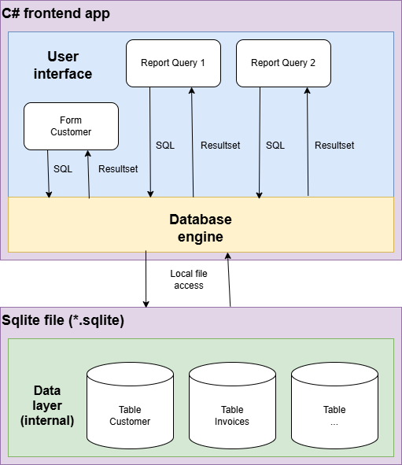
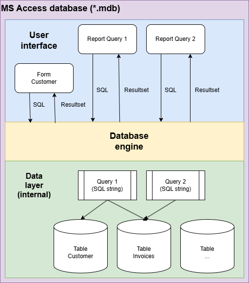
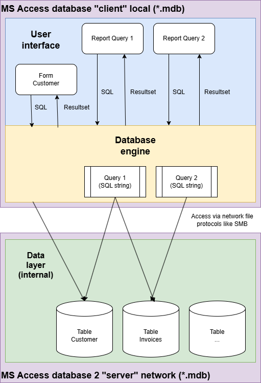
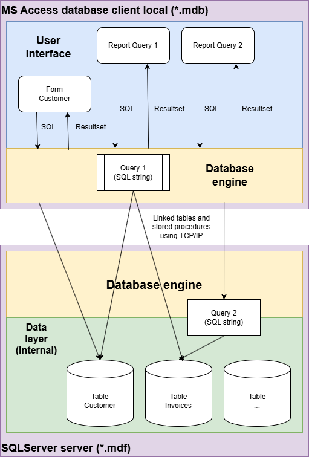

Persisting data
===============

# General idea and important persistance technologies 

Persisting data means storing data in a permanent way with the ability to store into ("serialize") and retrieve from ("deserialize") a data storage.

Persisting data should work without data loss during storing and restoring.

A general requirement for persistance is nowadays to implement it in a data storage saving manner.

Additional requirements may apply to persistance. One important requirement is often to persist data in a protect manner like encrypting data.

The are at least four main persistance technologies in use nowadays:

>   [Relational databases](#relational-databases)

>   [Plain text files](#persisting-data)

>   [JSON](#json-java-script-object-notation)

>   [XML](#xml-extendable-markup-langage)

# Relational databases

The most important way to persist data is storing them into a relational database like SqlServer, MySQL, PostgresSQL etc. supporting the Structured Query Language (SQL).

Relational means the data in the database are stored into different tables having relations to each other via key fields. 

Imagine a table **Customer** having the following fields:

-   Id (integer)
-   CustomerName (string)
-   ...

And a table **Invoice**:

-   Id (integer)
-   CustomerId (integer)
-   InvoiceDate (date)
-   Amount  (money)
-   ...

This both tables a related to each other via the fields Invoice.CustomerID and Customer.Id. This type of relation is called one-to-many relationship (1-n-relationship): each customer is existing only once in table customer but may have zero, one or many invoices. 

Key fields should have no other meaning then being a key field. Do NOT use fields like customer number, tax identification number or person identification number as key fields. They may change (even if the customer, tax payer or person does not change).

If you combine two 1-n-relationships in a certain way you get a mmany-to-many-relationship (n-n-relationship). Imagine two more tables for saving the products the customer is interested in. 

First is **Product** table:

-   Id (integer)
-   ProductName (string)
-   ...

The other table is **CustomerProducts**:

-   Id (integer)
-   CustomerId (integer)
-   ProductId (integer)
-   ...

Each table should have an Id field being the primary (distinction) key field for this table. The only purpose of this field is being an unique identifier for a certain data row. Primary key fields normally have the data type integer (tables with limited number of data rows) or uniqueidentifier (for tables with huge numbers of data rows or high fluctuation of data rows).

Databases using consequently the relational data model with key fields are called *normalized*.

Relational database systems use binary technologies to persist data internally. Normally they have the ability to protect data in a granular way based on technologies like user or group permissions and file or data encryption. 

Relational database systems are generally performant compared to other persistance technologies and are intended to store huge data amounts.

Relational databases can be implemented as file based databases for lower requirements and as server system for higher data volume and performance requirements. File based SQL databases are the most simple types of SQL databases. There purpose is normally serving only one user and one thread. Multiuser and multithreading capabilities are very limited. The biggest advantage of file based databases is the relatively simple usability. MS Access or Sqlite are two wellknown representatives of file based SQL databases. 

Server systems are MySql, PostgreSQL, Oracle, MS SqlServer etc..

## Basic components of relational database systems

-   **Tables**: a table is a data storage organized in rows and columns (fields). To be performant accessible the fields of a table need to have a defined data type.

-   **Queries**: a query is used to manipulated data in a query (i.e. INSERT, UPDATE or DELETE statement) or to retrieve data from one or more tables (SELECT statement). Queries can be stored in the database (so called stored procedures) or defined and run adhoc. The result is a resultset of data rows and columns. In C# the basic resultset is a System.Data.DataTable or a Sytem.Data.DataReader instance.

-   **Forms**: Userfriendly user interface to fill data in a table or to create a criteria for querying the database. All inputs are translated to SQL and delivered to the database engine running the SQL statements. Outputs are received from the database engine as query resultset and shown as a userfriendly screen output.

-   **Reports**: the basic idea is bringing database engine outputs in a userfriendly and layouted printable form.

Not all database systems implement all these basic components. MS Access implements them all. Sqlite, MS SqlServer and the most other relational database systems implement only tables and queries. Forms and reports can be built with languages like C# for these systems.

## Sqlite as file based SQL database

Sqlite is one of the most simple and leightweighted SQL database systems available currently. A Sqlite database contains only tables in a file usually with extension *.sqlite. Queries are sent as SQL string to the database engine and executed locally. 



For more details regarding using Sqlite in a C# project see documentation for [Bodoconsult.Database.Sqlite nuget package](https://github.com/RobertLeisner/Bodoconsult.Database/tree/main/doc/Bodoconsult.Database.Sqlite).

## MS Access as file based SQL database

MS Access uses the JET database engine to execute SQl commands.

### MS Access single user single file database 



### MS Access limited multiuser database

As the database engine is located on the client all SQL statements are executed on the client. This means all needed tables for a query have to copied to client via relatively slow network file protocol from server file to client. This makes performance and stability poor.



## MS Access as frontend for MS SqlServer

MS Access can be used as a frontend for a SqlServer. In these case you have to work with linked tables and direct queries. Both use Open Database Connectivity (ODBC). Try to use direct queries to avoid network traffic for loading table data for local query execution.

In this scenario you employ two database engine: the Access JET engine on the client and the SqlServer database engine on the server. The draw back of two database engines is a minor performance.




## Server based SQL relational database system MS SqlServer

MS SqlServer, MS SqlServer Express and LocalDB use the same database engine with the same basic SQL commands. LocalDB is not intended for production purposes but for developers.

Instead of a database engine like JET on the client you use a database provider on the client. A database provider forwards SQL statements to the server and delivers the resultsets to the client. It is a very lightweight layer compared to JET database engine for example.

If you work with SqlServer or LocalDB install SqlServer Management Studio (SSMS) to access server instances and databases easily.

For more details regarding using MS SqlServer, MS SqlServer Express and LocalDB in a C# project see documentation for [Bodoconsult.Database.SqlClient nuget package](https://github.com/RobertLeisner/Bodoconsult.Database/tree/main/doc/Bodoconsult.Database.SqlClient).

### SqlServer  and SqlServer Express

The default instance name is the IP address the MS SqlServer is installed on . Use this name in SSMS.

### LocalDb

To manage your local LocalDb installation use the SqlLocalDB.exe tool. With this tool you can create and drop instances, create and drop databases etc..

To show all LocalDB instances on your PC use:

```
SqlLocalDB.exe i
```

The default instance name is (localdb)\MSSQLLocalDB. Use this name in SSMS.

For the administration of LocalDB instances use SqLOcalDB tool. See the following command for help:

```
SqlLocalDB.exe -?
```

# Plain text files

## Basics

Plain text files store data in a formatted manner ("separated") but normally without further protection.

Dependent on the data to store this type of persistance is normally only a good choice for simple data to persist.

As separaters are commonly used the comma or the semicolon.

Plain text files are normally using ASCII, ANSI, UTF-8 encoding. Watch out for German Umlaute (ä, ö, ü, ...). Choosing the wrong encoding you will loose them!

Here a sample for comma separated CSV file

```

Date,Amount,Remark
20241129,100,09,InvNo R190100/24
20240829,67,09,Car fuel
20250429,100,09,InvNo R198999/24

```

Some data types are subject to current language settings of the user persisting and / or restoring data. Dates or numbers with digits are typical examples.

## Sample implementation

``` csharp

/// <summary>
/// Class to serialize account statements into CSF files
/// </summary>
public class AccountStatementTextSerializer
{

    public char Delimiter { get; set; } = ',';


    /// <summary>
    /// Serialize an account statement
    /// </summary>
    /// <param name="accountStatement">Account statement to serialize</param>
    /// <returns>Serialized account statement</returns>
    public string Serialize(AccountStatement accountStatement)
    {
        var s = new StringBuilder();

        s.AppendLine($"Date{Delimiter}Amount{Delimiter}Remark"); // Header line

        foreach (var item in accountStatement.AccountStatementItems)
        {
            s.AppendLine($"{item.Date:yyyyMMdd}{Delimiter}{item.Amount:0.00}{Delimiter}{item.Remark}"); // Item line
        }

        return s.ToString();

    }


    /// <summary>
    /// Serialize a account statement into a CSV file
    /// </summary>
    /// <param name="accountStatement">Account statement to serialize</param>
    /// <param name="fileName">Full path to file to persist the account statement in</param>

    public void SerializeToFile(AccountStatement accountStatement, string fileName)
    {

        // No file name
        if (string.IsNullOrEmpty(fileName))
        {
            throw new FileNotFoundException("No valid file name was provided!");
        }

        // If the file already exists delete it
        if (File.Exists(fileName))
        {
            File.Delete(fileName);
        }

        // Create the file content now
        var result = Serialize(accountStatement);

        // Save content to file
        File.WriteAllText(fileName, result);

    }


    /// <summary>
    /// Deserialize an object from a JSON file
    /// </summary>
    /// <param name="fileName">Full path to file to persist the account statement in</param>
    /// <returns>Deserialized account statement </returns>

    public AccountStatement DeserializeFromFile(string fileName)
    {

        // Check if the file exists
        if (!File.Exists(fileName))
        {
            throw new FileNotFoundException($"File {fileName} NOT found!");
        }

        // Read file
        var content = File.ReadAllText(fileName);

        // Deserialize content
        var accountStatement = Deserialize(content);

        return accountStatement;
    }

    /// <summary>
    /// Deserialize a serialized account statement
    /// </summary>
    /// <param name="content">Serialized account statement</param>
    /// <returns>Account statement</returns>
    /// <exception cref="Exception"></exception>
    public AccountStatement Deserialize(string content)
    {
        // Split file in lines
        var lines = content.Split(Environment.NewLine, StringSplitOptions.RemoveEmptyEntries);

        // 
        var accountStatement = new AccountStatement();

        var lineNumber = 0;
        foreach (var line in lines)
        {
            // Skip the header
            if (lineNumber == 0)
            {
                lineNumber++;
                continue;
            }

            lineNumber++;

            // Split the line in items
            var items = line.Split(Delimiter, StringSplitOptions.RemoveEmptyEntries);

            if (items.Length < 3)
            {
                throw new Exception($"Not enough items for an account statement item: {line}!");
            }

            var year = Convert.ToInt32(items[0].Substring(0, 4));
            var month = Convert.ToInt32(items[0].Substring(4, 2));
            var day = Convert.ToInt32(items[0].Substring(6, 2));

            var accountStatementItem = new AccountStatementItem
            {
                Date = new DateTime(year, month, day),
                Amount = Convert.ToSingle(items[1]),
                Remark = items[2]
            };

            accountStatement.AccountStatementItems.Add(accountStatementItem);
        }

        return accountStatement;
    }
}


```
## Tests for the sample implementation

``` csharp

[TestFixture]
public class PlainTextpersistanceTests
{


    [Test]
    public void SerializeToPlainText()
    {
        // Arrange 
        var accounStatement = new AccountStatement();

        var item = new AccountStatementItem
        {
            Date = DateTime.Now,
            Amount = 100.09,
            Remark = "InvNo R190100/24"
        };

        accounStatement.AccountStatementItems.Add(item);

        item = new AccountStatementItem
        {
            Date = DateTime.Now.AddMonths(-3),
            Amount = 67.09,
            Remark = "Car fuel"
        };

        accounStatement.AccountStatementItems.Add(item);

        item = new AccountStatementItem
        {
            Date = DateTime.Now.AddMonths(5),
            Amount = 100.09,
            Remark = "InvNo R198999/24"
        };

        accounStatement.AccountStatementItems.Add(item);

        var serializer = new AccountStatementTextSerializer();


        // Act  
        var serializedResult = serializer.Serialize(accounStatement);

        // Assert
        Assert.That(serializedResult, Is.Not.Null);

        Debug.Print(serializedResult);

        /* Prints:

        Date,Amount,Remark
        20241204,100,09,InvNo R190100/24
        20240904,67,09,Car fuel
        20250504,100,09,InvNo R198999/24

         */

    }


    [Test]
    public void DeserializeFromPlainText()
    {
        // Arrange 
        var accountStatement = new AccountStatement();

        var item = new AccountStatementItem
        {
            Date = DateTime.Now,
            Amount = 100.09,
            Remark = "InvNo R190100/24"
        };

        accountStatement.AccountStatementItems.Add(item);

        item = new AccountStatementItem
        {
            Date = DateTime.Now.AddMonths(-3),
            Amount = 67.09,
            Remark = "Car fuel"
        };

        accountStatement.AccountStatementItems.Add(item);

        item = new AccountStatementItem
        {
            Date = DateTime.Now.AddMonths(5),
            Amount = 100.09,
            Remark = "InvNo R198999/24"
        };

        accountStatement.AccountStatementItems.Add(item);

        var serializer = new AccountStatementTextSerializer();

        var serializedResult = serializer.Serialize(accountStatement);


        // Act  
        var deserializedResult = serializer.Deserialize(serializedResult);

        // Assert
        Assert.That(deserializedResult, Is.Not.Null);

        Assert.That(deserializedResult.AccountStatementItems.Count, Is.EqualTo(accountStatement.AccountStatementItems.Count));

    }

    [Test]
    public void SerializeToAndDeserializeFromPlainTextFile()
    {
        // Arrange 
        var accountStatement = new AccountStatement();

        var item = new AccountStatementItem
        {
            Date = DateTime.Now,
            Amount = 100.09,
            Remark = "InvNo R190100/24"
        };

        accountStatement.AccountStatementItems.Add(item);

        item = new AccountStatementItem
        {
            Date = DateTime.Now.AddMonths(-3),
            Amount = 67.09,
            Remark = "Car fuel"
        };

        accountStatement.AccountStatementItems.Add(item);

        item = new AccountStatementItem
        {
            Date = DateTime.Now.AddMonths(5),
            Amount = 100.09,
            Remark = "InvNo R198999/24"
        };

        accountStatement.AccountStatementItems.Add(item);

        var fileName = Path.Combine(Environment.GetFolderPath(Environment.SpecialFolder.MyDocuments), "PlainTextSample.csv");

        var serializer = new AccountStatementTextSerializer();

        serializer.SerializeToFile(accountStatement, fileName);


        // Act  
        var deserializedResult = serializer.DeserializeFromFile(fileName);

        // Assert
        Assert.That(deserializedResult, Is.Not.Null);

        Assert.That(deserializedResult.AccountStatementItems.Count, Is.EqualTo(accountStatement.AccountStatementItems.Count));

    }
}

```


# JSON (Java Script Object Notation)


There are 2 common JSON libraries used in .NET:

-   System.Text.Json (.NET internal library)
-   Newtonsoft JSON (Nuget package)

Newtonsoft is more flexible and powerful than System.Text.Json but incorrect usage may introduce severe security risks to an app.

JSON files are normally plain text files using UTF-8 encoding.

``` json
{
    "AccountStatementItems": [
    {
        "Date": "2024-12-04T14:57:58.1721273+01:00",
        "Amount": 100.09,
        "Remark": "InvNo R190100/24"
    },
    {
        "Date": "2024-09-04T14:57:58.1722888+02:00",
        "Amount": 67.09,
        "Remark": "Car fuel"
    },
    {
        "Date": "2025-05-04T14:57:58.1722983+02:00",
        "Amount": 100.09,
        "Remark": "InvNo R198999/24"
    }
    ]
}

```

## Sample implementation

``` csharp

using Newtonsoft.Json;

namespace CodingBasics.persistance;

/// <summary>
/// Class to serialize account statements into JSON files
/// </summary>
public static class JsonHelper
{
    /// <summary>
    /// Serialize an object to a string
    /// </summary>
    /// <param name="obj">Object to serialize</param>
    /// <returns>String with JSON</returns>

    public static string Serialize(object obj)
    {
        var result = JsonConvert.SerializeObject(obj, Formatting.Indented);
        return result;
    }

    /// <summary>
    /// Deserialize a object from a JSON string
    /// </summary>
    /// <typeparam name="T">Type of the object to derialize in</typeparam>
    /// <param name="json">JSON with the serialized object</param>
    /// <returns>Instance of type T</returns>
    public static T Deserialize<T>(string json)
    {
        var result = JsonConvert.DeserializeObject<T>(json);
        return result;
    }


    /// <summary>
    /// Serialize an object into a JSON file
    /// </summary>
    /// <param name="obj">Object to serialize</param>
    /// <param name="fileName">Full path to file to persist the object</param>

    public static void SerializeToFile(object obj, string fileName)
    {
        // No file name
        if (string.IsNullOrEmpty(fileName))
        {
            throw new FileNotFoundException("No valid file name was provided!");
        }

        // If the file already exists delete it
        if (File.Exists(fileName))
        {
            File.Delete(fileName);
        }

        // Create the file content now
        var result = Serialize(obj);

        // Save content to file
        File.WriteAllText(fileName, result);

    }


    /// <summary>
    /// Deserialize an object from a JSON file
    /// </summary>
    /// <typeparam name="T">Type of of the object the serializer should return</typeparam>
    /// <param name="fileName">Full file path to the JSON file</param>
    /// <returns>Type of of the object the serializer should return</returns>
    /// <exception cref="FileNotFoundException">File is not existing</exception>
    public static T DeserializeFromFile<T>(string fileName)
    {

        // Check if the file exists
        if (!File.Exists(fileName))
        {
            throw new FileNotFoundException($"File {fileName} NOT found!");
        }

        // Read file
        var content = File.ReadAllText(fileName);

        // Deserialize content
        var resultObject = Deserialize<T>(content);

        return resultObject;
    }

}

```
## Tests for the sample implementation

``` csharp

[TestFixture]
public class JsonpersistanceTests
{


    [Test]
    public void SerializeToPlainText()
    {
        // Arrange 
        var accounStatement = new AccountStatement();

        var item = new AccountStatementItem
        {
            Date = DateTime.Now,
            Amount = 100.09,
            Remark = "InvNo R190100/24"
        };

        accounStatement.AccountStatementItems.Add(item);

        item = new AccountStatementItem
        {
            Date = DateTime.Now.AddMonths(-3),
            Amount = 67.09,
            Remark = "Car fuel"
        };

        accounStatement.AccountStatementItems.Add(item);

        item = new AccountStatementItem
        {
            Date = DateTime.Now.AddMonths(5),
            Amount = 100.09,
            Remark = "InvNo R198999/24"
        };

        accounStatement.AccountStatementItems.Add(item);


        // Act  
        var serializedResult = JsonHelper.Serialize(accounStatement);

        // Assert
        Assert.That(serializedResult, Is.Not.Null);

        Debug.Print(serializedResult);

        /*
        
        {
          "AccountStatementItems": [
            {
              "Date": "2024-12-04T14:57:58.1721273+01:00",
              "Amount": 100.09,
              "Remark": "InvNo R190100/24"
            },
            {
              "Date": "2024-09-04T14:57:58.1722888+02:00",
              "Amount": 67.09,
              "Remark": "Car fuel"
            },
            {
              "Date": "2025-05-04T14:57:58.1722983+02:00",
              "Amount": 100.09,
              "Remark": "InvNo R198999/24"
            }
          ]
        }

         */
    }


    [Test]
    public void DeserializeFromPlainText()
    {
        // Arrange 
        var accountStatement = new AccountStatement();

        var item = new AccountStatementItem
        {
            Date = DateTime.Now,
            Amount = 100.09,
            Remark = "InvNo R190100/24"
        };

        accountStatement.AccountStatementItems.Add(item);

        item = new AccountStatementItem
        {
            Date = DateTime.Now.AddMonths(-3),
            Amount = 67.09,
            Remark = "Car fuel"
        };

        accountStatement.AccountStatementItems.Add(item);

        item = new AccountStatementItem
        {
            Date = DateTime.Now.AddMonths(5),
            Amount = 100.09,
            Remark = "InvNo R198999/24"
        };

        accountStatement.AccountStatementItems.Add(item);

        var serializedResult = JsonHelper.Serialize(accountStatement);

        // Act  
        var deserializedResult = JsonHelper.Deserialize<AccountStatement>(serializedResult);

        // Assert
        Assert.That(deserializedResult, Is.Not.Null);

        Assert.That(deserializedResult.AccountStatementItems.Count, Is.EqualTo(accountStatement.AccountStatementItems.Count));

    }

    [Test]
    public void SerializeToAndDeserializeFromPlainTextFile()
    {
        // Arrange 
        var accountStatement = new AccountStatement();

        var item = new AccountStatementItem
        {
            Date = DateTime.Now,
            Amount = 100.09,
            Remark = "InvNo R190100/24"
        };

        accountStatement.AccountStatementItems.Add(item);

        item = new AccountStatementItem
        {
            Date = DateTime.Now.AddMonths(-3),
            Amount = 67.09,
            Remark = "Car fuel"
        };

        accountStatement.AccountStatementItems.Add(item);

        item = new AccountStatementItem
        {
            Date = DateTime.Now.AddMonths(5),
            Amount = 100.09,
            Remark = "InvNo R198999/24"
        };

        accountStatement.AccountStatementItems.Add(item);

        var fileName = Path.Combine(Environment.GetFolderPath(Environment.SpecialFolder.MyDocuments), "JsonSample.json");

        JsonHelper.SerializeToFile(accountStatement, fileName);


        // Act  
        var deserializedResult = JsonHelper.DeserializeFromFile<AccountStatement>(fileName);

        // Assert
        Assert.That(deserializedResult, Is.Not.Null);

        Assert.That(deserializedResult.AccountStatementItems.Count, Is.EqualTo(accountStatement.AccountStatementItems.Count));

    }
}

```


# XML (Extendable markup langage)

The Extensible Markup Language (XML) is a common language to persist hierachical data independent from operation system and technologies. 
Basically a XML file is a UTF-8 encoded plain text file normally with the extension xml.

XML allows validation of persisted data with the help of a Document Type Definition (DTD) or a XML schema (XSD). 
With a DTD or a XSD working like a contract the persisted data can be checked for formal correctness.

XML files are normally plain text files using UTF-8 encoding.

``` xml

<?xml version="1.0" encoding="utf-16"?>
<AccountStatement xmlns:xsi="http://www.w3.org/2001/XMLSchema-instance" xmlns:xsd="http://www.w3.org/2001/XMLSchema">
<AccountStatementItems>
    <AccountStatementItem>
    <Date>2024-12-04T10:27:26.0817472+01:00</Date>
    <Amount>100.09</Amount>
    <Remark>InvNo R190100/24</Remark>
    </AccountStatementItem>
    <AccountStatementItem>
    <Date>2024-09-04T10:27:26.0818507+02:00</Date>
    <Amount>67.09</Amount>
    <Remark>Car fuel</Remark>
    </AccountStatementItem>
    <AccountStatementItem>
    <Date>2025-05-04T10:27:26.0818628+02:00</Date>
    <Amount>100.09</Amount>
    <Remark>InvNo R198999/24</Remark>
    </AccountStatementItem>
</AccountStatementItems>
</AccountStatement>

```


## Sample implementation

``` csharp

/// <summary>
/// Helper class for simple XML serialization
/// </summary>
public static class XmlHelper
{

    /// <summary>
    /// Serialize an object to a XML string
    /// </summary>
    /// <param name="obj"></param>
    /// <returns></returns>
    public static string Serialize(object obj)
    {
        var xmlSerializer = new XmlSerializer(obj.GetType());

        using (var textWriter = new StringWriter())
        {
            xmlSerializer.Serialize(textWriter, obj);
            return textWriter.ToString();
        }
    }

    /// <summary>
    /// Deserialize a object from a XML string
    /// </summary>
    /// <typeparam name="T">Type of the object to derialize in</typeparam>
    /// <param name="xml">XML with the serialized object</param>
    /// <returns>Instance of type T</returns>
    public static T Deserialize<T>(string xml)
    {
        var xmlSerializer = new XmlSerializer(typeof(T));

        T result;

        using (var textReader = new StringReader(xml))
        {
            result = (T)xmlSerializer.Deserialize(textReader);
        }

        return result;
    }

    /// <summary>
    /// Serialize an object into a XML file
    /// </summary>
    /// <param name="obj">Object to serialize</param>
    /// <param name="fileName">Full path to file to persist the object in</param>

    public static void SerializeToFile(object obj, string fileName)
    {
        // No file name
        if (string.IsNullOrEmpty(fileName))
        {
            throw new FileNotFoundException("No valid file name was provided!");
        }

        // If the file already exists delete it
        if (File.Exists(fileName))
        {
            File.Delete(fileName);
        }

        // Create the file content now
        var result = Serialize(obj);

        // Save content to file
        File.WriteAllText(fileName, result);

    }


    /// <summary>
    /// Deserialize an object from a XML file
    /// </summary>
    /// <typeparam name="T">Type of of the object the serializer should return</typeparam>
    /// <param name="fileName">Full file path to the XML file</param>
    /// <returns>Type of of the object the serializer should return</returns>
    /// <exception cref="FileNotFoundException">File is not existing</exception>
    public static T DeserializeFromFile<T>(string fileName)
    {

        // Check if the file exists
        if (!File.Exists(fileName))
        {
            throw new FileNotFoundException($"File {fileName} NOT found!");
        }

        // Read file
        var content = File.ReadAllText(fileName);

        // Deserialize content
        var resultObject = Deserialize<T>(content);

        return resultObject;
    }

}

```
## Tests for the sample implementation

``` csharp

[TestFixture]
public class XmlpersistanceTests
{


    [Test]
    public void SerializeToPlainText()
    {
        // Arrange 
        var accounStatement = new AccountStatement();

        var item = new AccountStatementItem
        {
            Date = DateTime.Now,
            Amount = 100.09,
            Remark = "InvNo R190100/24"
        };

        accounStatement.AccountStatementItems.Add(item);

        item = new AccountStatementItem
        {
            Date = DateTime.Now.AddMonths(-3),
            Amount = 67.09,
            Remark = "Car fuel"
        };

        accounStatement.AccountStatementItems.Add(item);

        item = new AccountStatementItem
        {
            Date = DateTime.Now.AddMonths(5),
            Amount = 100.09,
            Remark = "InvNo R198999/24"
        };

        accounStatement.AccountStatementItems.Add(item);


        // Act  
        var serializedResult = XmlHelper.Serialize(accounStatement);

        // Assert
        Assert.That(serializedResult, Is.Not.Null);

        Debug.Print(serializedResult);

        /* Prints:

            <?xml version="1.0" encoding="utf-16"?>
            <AccountStatement xmlns:xsi="http://www.w3.org/2001/XMLSchema-instance" xmlns:xsd="http://www.w3.org/2001/XMLSchema">
            <AccountStatementItems>
                <AccountStatementItem>
                <Date>2024-12-04T10:27:26.0817472+01:00</Date>
                <Amount>100.09</Amount>
                <Remark>InvNo R190100/24</Remark>
                </AccountStatementItem>
                <AccountStatementItem>
                <Date>2024-09-04T10:27:26.0818507+02:00</Date>
                <Amount>67.09</Amount>
                <Remark>Car fuel</Remark>
                </AccountStatementItem>
                <AccountStatementItem>
                <Date>2025-05-04T10:27:26.0818628+02:00</Date>
                <Amount>100.09</Amount>
                <Remark>InvNo R198999/24</Remark>
                </AccountStatementItem>
            </AccountStatementItems>
            </AccountStatement>

        */

    }


    [Test]
    public void DeserializeFromPlainText()
    {
        // Arrange 
        var accountStatement = new AccountStatement();

        var item = new AccountStatementItem
        {
            Date = DateTime.Now,
            Amount = 100.09,
            Remark = "InvNo R190100/24"
        };

        accountStatement.AccountStatementItems.Add(item);

        item = new AccountStatementItem
        {
            Date = DateTime.Now.AddMonths(-3),
            Amount = 67.09,
            Remark = "Car fuel"
        };

        accountStatement.AccountStatementItems.Add(item);

        item = new AccountStatementItem
        {
            Date = DateTime.Now.AddMonths(5),
            Amount = 100.09,
            Remark = "InvNo R198999/24"
        };

        accountStatement.AccountStatementItems.Add(item);

        var serializedResult = XmlHelper.Serialize(accountStatement);

        // Act  
        var deserializedResult = XmlHelper.Deserialize<AccountStatement>(serializedResult);

        // Assert
        Assert.That(deserializedResult, Is.Not.Null);

        Assert.That(deserializedResult.AccountStatementItems.Count, Is.EqualTo(accountStatement.AccountStatementItems.Count));

    }

    [Test]
    public void SerializeToAndDeserializeFromPlainTextFile()
    {
        // Arrange 
        var accountStatement = new AccountStatement();

        var item = new AccountStatementItem
        {
            Date = DateTime.Now,
            Amount = 100.09,
            Remark = "InvNo R190100/24"
        };

        accountStatement.AccountStatementItems.Add(item);

        item = new AccountStatementItem
        {
            Date = DateTime.Now.AddMonths(-3),
            Amount = 67.09,
            Remark = "Car fuel"
        };

        accountStatement.AccountStatementItems.Add(item);

        item = new AccountStatementItem
        {
            Date = DateTime.Now.AddMonths(5),
            Amount = 100.09,
            Remark = "InvNo R198999/24"
        };

        accountStatement.AccountStatementItems.Add(item);

        var fileName = Path.Combine(Environment.GetFolderPath(Environment.SpecialFolder.MyDocuments), "XmlSample.xml");

        XmlHelper.SerializeToFile(accountStatement, fileName);


        // Act  
        var deserializedResult = XmlHelper.DeserializeFromFile<AccountStatement>(fileName);

        // Assert
        Assert.That(deserializedResult, Is.Not.Null);

        Assert.That(deserializedResult.AccountStatementItems.Count, Is.EqualTo(accountStatement.AccountStatementItems.Count));

    }
}

```
