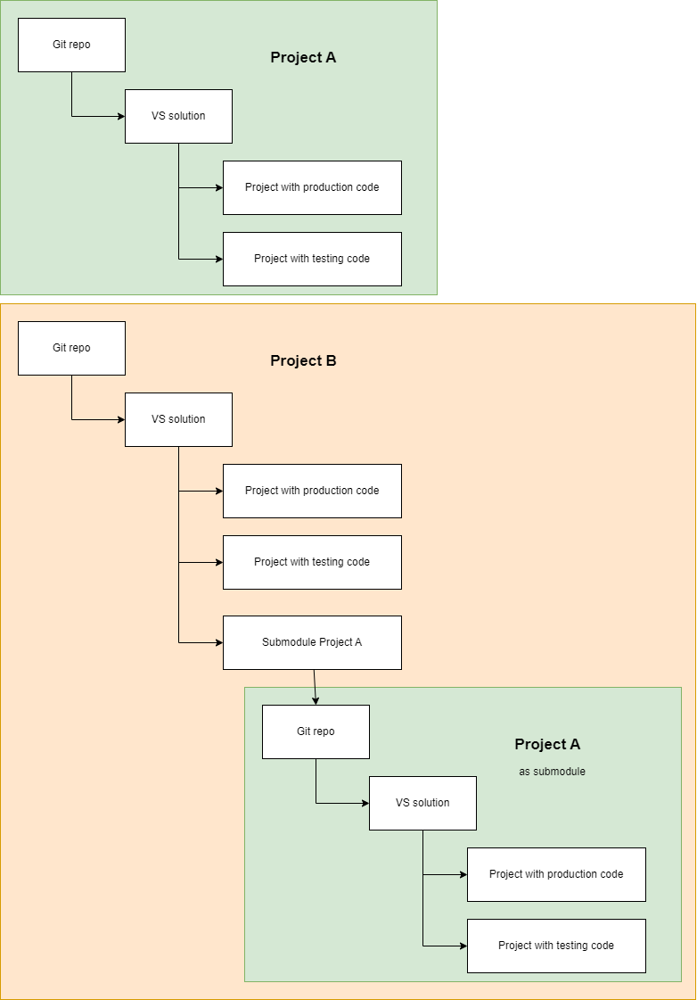

Source code management
===========

# Overview

## Folder based source code management

The simplest way of source code management is employing a central folder in the operating system containing the master source code.

Working with a folder based source code managment has a lot of drawbacks. Keeping old versions is possible but demanding. Keeping a change history is nearly impossible.

Folder based source code management is very limited and only feasable for a one-person-deleveloper-team.

##  Version control system (CVS)

A version control system handles nearly all tasks of source code management for you. It keeps track of change history. 

# Git

Git is the de-facto standard distributed version control system. Distributed means you have you own CVS on your local computer and a central CVS in the cloud or at a server in your company.

Both CVS instances can and should work together. With PULL command to fetch code from central CVS and with PUSH command you bring it back to central CVS. Locally you work with the pulled source code.

https://git-scm.com/

# Using Git practically

## Plain Git

## Github


## GitLab


# Git repositories and monorepos

## Git repo structure best practices

It is recommend to separate code files from test code and documentation. Production code should go src folder, test code to tests folder and documentaio to doc folder.

Here a sample for a Git repo structure:


## Single project repositiories


Singe project repositories contain normally one project with production code and another project with unit test code.

The following chart shows a typical Git repo structure for a Project A and its use as a Git submodule in a Project B:



### Pros

-   Small repo size

-   Fast access

-   Clear structure in the repo

### Cons

-   Using a project in another project may become more demanding as you have to use eather Git submodules or Nuget packages
-   Deployment of releases (setting version number, settings tags, building, ...) more depanding for dependent repos
-   Handling submodules in multiple levels gets complex and error prone

### Handling recommendations

Use a single project only if the project has only Nuget dependencies and is not used in other projects as dependency.

If the project is used in multiple projects as dependency create a publicly or privately
distributed Nuget package.

## Monorepo

A monorepo contains all projects related to a certain logical project. 


### Pros

-   Size can grow fast

-   Deployment of releases (setting version number, settings tags, building, ...) simplified as all solutions in the repo have same state

-   May contain all VS solutions related to the project independent of the framwork and the language used for implementation

-   Less repos to handle compared to a single repo solution

-   No need to use Git submodules

-   CI/CD setup similar to a single repo solution

### Cons

-   Increasing repo size may require additional work to setup special Git features for large repos

-   Internal Repo structure may get less clear compared to a single repo solution


### Handling recommendations


# Repository structure for typical app types


# Practical Git Handling

## Add an existing folder to a new Git repo

Start Git bash.

Change to to the existing folder with the command cd (change directory). Pay attention to replace the backslash with a slash in the command line as git bash is a UNIX software:

```
cd C:/Daten/Projekte/Tools/Bodoconsult.Database
```

Now prepare the folder for Git:

```
git init
```

Connect the remote repo now with the current folder:

```
git remote add origin https://github.com/RobertLeisner/Bodoconsult.Database.git
```

Newer GIT installation use a new main branch name "Main" instead of deprecated name "Master". To rename your local branch use:

```
git branch -m master main
```

If the remote branch main already exists call:

```
git pull origin main
```

If you create a new repo i.e. in Github you can let Github create some basic files for you. This is not necassary!

Now add a full setup .gitignore file and other basic files like Readme.md. A .gitignore file is urgently necessary to avoid build process files be included in the Git repo and blowing it up from size.

```
git add --all
```

Now commit (store the changes to local Git repo):

```
git commit -m 'Added basic files'
```

Now push the locally committed changes to the remote repo.

```
git push origin main
```
